
<picture><source media="(prefers-color-scheme: dark)" srcset="./assets/terminal-dark.svg"><source media="(prefers-color-scheme: light)" srcset="./assets/terminal-light.svg">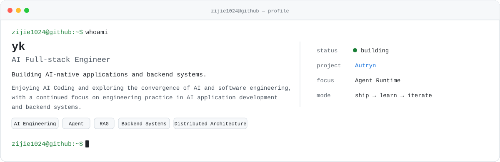</picture>

<picture><source media="(prefers-color-scheme: dark)" srcset="./assets/about-dark.svg"><source media="(prefers-color-scheme: light)" srcset="./assets/about-light.svg">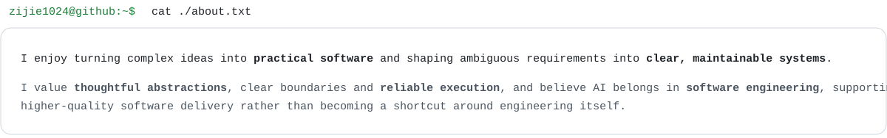</picture>

<picture><source media="(prefers-color-scheme: dark)" srcset="./assets/projects-command-dark.svg"><source media="(prefers-color-scheme: light)" srcset="./assets/projects-command-light.svg">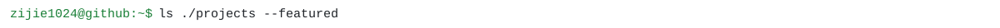</picture>

<a href="https://github.com/zijie1024"><picture><source media="(prefers-color-scheme: dark)" srcset="./assets/project-autryn-dark.svg"><source media="(prefers-color-scheme: light)" srcset="./assets/project-autryn-light.svg">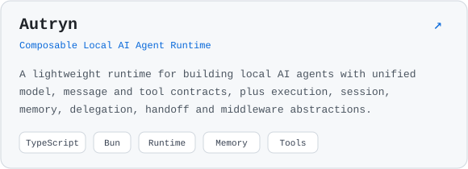</picture></a>&nbsp;<a href="https://github.com/zijie1024/utils"><picture><source media="(prefers-color-scheme: dark)" srcset="./assets/project-utils-dark.svg"><source media="(prefers-color-scheme: light)" srcset="./assets/project-utils-light.svg">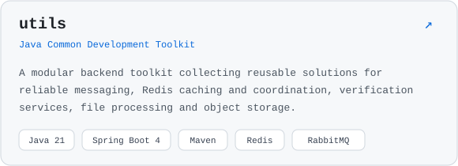</picture></a>

<picture><source media="(prefers-color-scheme: dark)" srcset="./assets/stack-dark.svg"><source media="(prefers-color-scheme: light)" srcset="./assets/stack-light.svg">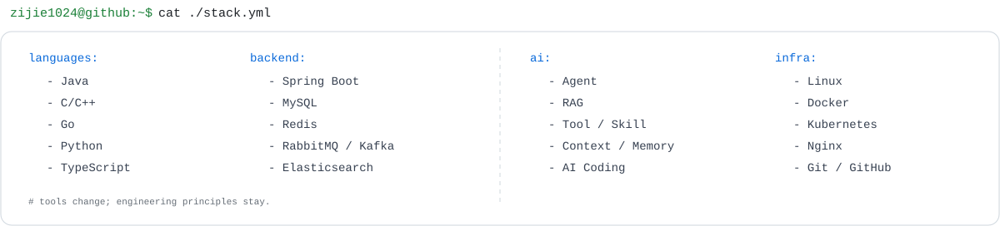</picture>

<picture><source media="(prefers-color-scheme: dark)" srcset="./assets/contributions-dark.svg"><source media="(prefers-color-scheme: light)" srcset="./assets/contributions-light.svg">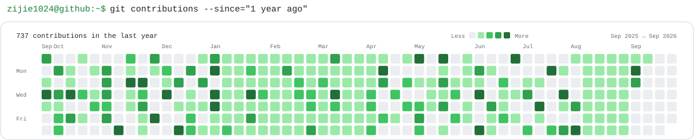</picture>

<picture><source media="(prefers-color-scheme: dark)" srcset="./assets/connect-command-dark.svg"><source media="(prefers-color-scheme: light)" srcset="./assets/connect-command-light.svg"></picture>

<a href="https://github.com/zijie1024"><picture><source media="(prefers-color-scheme: dark)" srcset="./assets/connect-github-dark.svg"><source media="(prefers-color-scheme: light)" srcset="./assets/connect-github-light.svg">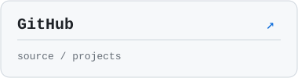</picture></a>&nbsp;<a href="https://github.com/zijie1024"><picture><source media="(prefers-color-scheme: dark)" srcset="./assets/connect-blog-dark.svg"><source media="(prefers-color-scheme: light)" srcset="./assets/connect-blog-light.svg">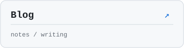</picture></a>&nbsp;<a href="https://github.com/zijie1024"><picture><source media="(prefers-color-scheme: dark)" srcset="./assets/connect-email-dark.svg"><source media="(prefers-color-scheme: light)" srcset="./assets/connect-email-light.svg">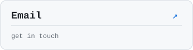</picture></a>

<picture><source media="(prefers-color-scheme: dark)" srcset="./assets/footer-dark.svg"><source media="(prefers-color-scheme: light)" srcset="./assets/footer-light.svg">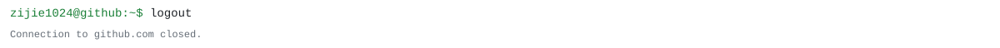</picture>

