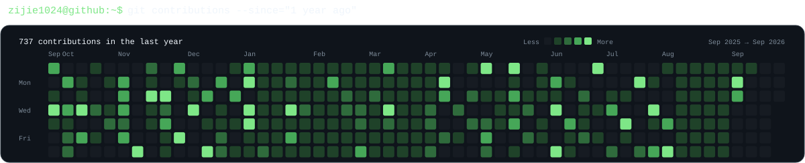

```text
zijie1024@github:~$ whoami

yk
AI Full-stack Engineer

Agent Runtime · AI Coding · Backend Systems · RAG · Developer Tools

status   building
project  Autryn
focus    Agent Runtime / Context Engineering
mode     ship → learn → iterate

zijie1024@github:~$ █
```

### `$ cat ./about.txt`

I build systems around **Agent Runtime**, **AI Coding**, **Backend Engineering** and **Retrieval-Augmented Generation**.

I care about clean abstractions, predictable execution, observability and making AI-assisted development feel like normal software engineering rather than a collection of demos.

### `$ ls ./projects --featured`

<table>
<tr>
<td width="55%" valign="top">
<h3>Autryn</h3>
<strong>Composable Local AI Agent Runtime</strong>
<br><br>
A lightweight runtime for building local AI agents with unified model, message and tool contracts, plus execution, session, memory, delegation, handoff and middleware abstractions.
<br><br>
<code>TypeScript</code>
<code>Bun</code>
<code>Runtime</code>
<code>Session</code>
<code>Memory</code>
<code>Tools</code>
</td>
<td width="45%" valign="top">
<h3><a href="https://github.com/zijie1024/utils">utils ↗</a></h3>
<strong>Java Common Development Toolkit</strong>
<br><br>
A modular backend toolkit collecting reusable solutions for reliable messaging, Redis caching and coordination, verification services, file processing and object storage.
<br><br>
<code>Java 21</code>
<code>Spring Boot 4</code>
<code>Maven</code>
<code>Redis</code>
<code>RabbitMQ</code>
</td>
</tr>
</table>

### `$ cat ./stack.yml`

```yaml
languages:
  - Java
  - TypeScript
  - Python

backend:
  - Spring Boot
  - MySQL
  - Redis
  - RabbitMQ

ai:
  - Agent Runtime
  - RAG
  - Tool / Skill
  - Context / Memory
  - AI Coding

infra:
  - Docker
  - Linux
  - GitHub Actions
```

### `$ git contributions --since="1 year ago"`

<p align="center">
<picture>
<source media="(prefers-color-scheme: dark)" srcset="./assets/contributions-dark.svg">
<source media="(prefers-color-scheme: light)" srcset="./assets/contributions-light.svg">

</picture>
</p>

### `$ ./connect`

<p align="center">
<a href="https://github.com/zijie1024">GitHub →</a>
&nbsp;&nbsp;&nbsp;&nbsp;
<a href="https://github.com/zijie1024">Blog →</a>
&nbsp;&nbsp;&nbsp;&nbsp;
<a href="https://github.com/zijie1024">Email →</a>
</p>

```text
zijie1024@github:~$ logout
Connection to github.com closed.
```
