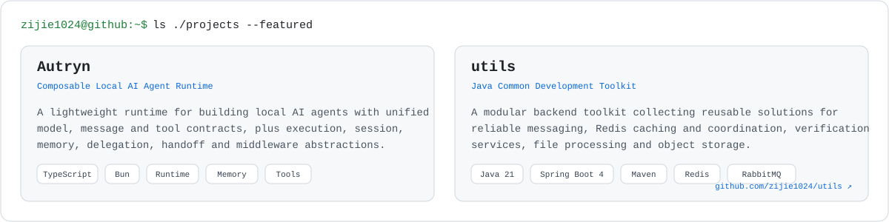

<picture>
<source media="(prefers-color-scheme: dark)" srcset="./assets/terminal-dark.svg">
<source media="(prefers-color-scheme: light)" srcset="./assets/terminal-light.svg">

</picture>

 

<picture>
<source media="(prefers-color-scheme: dark)" srcset="./assets/about-dark.svg">
<source media="(prefers-color-scheme: light)" srcset="./assets/about-light.svg">

</picture>

 

<picture>
<source media="(prefers-color-scheme: dark)" srcset="./assets/projects-dark.svg">
<source media="(prefers-color-scheme: light)" srcset="./assets/projects-light.svg">

</picture>

<a href="https://github.com/zijie1024"><code>./projects/autryn ↗</code></a>
&nbsp;&nbsp;
<a href="https://github.com/zijie1024/utils"><code>./projects/utils ↗</code></a>

 

<picture>
<source media="(prefers-color-scheme: dark)" srcset="./assets/stack-dark.svg">
<source media="(prefers-color-scheme: light)" srcset="./assets/stack-light.svg">

</picture>

 

<picture>
<source media="(prefers-color-scheme: dark)" srcset="./assets/contributions-dark.svg">
<source media="(prefers-color-scheme: light)" srcset="./assets/contributions-light.svg">

</picture>

 

<samp><strong>zijie1024@github:~$</strong> ./connect</samp>

<table width="100%">
<tr>
<td width="33%" align="center" valign="top">
<a href="https://github.com/zijie1024">
<picture>
<source media="(prefers-color-scheme: dark)" srcset="./assets/connect-github-dark.svg">
<source media="(prefers-color-scheme: light)" srcset="./assets/connect-github-light.svg">

</picture>
</a>
</td>
<td width="34%" align="center" valign="top">
<a href="https://github.com/zijie1024">
<picture>
<source media="(prefers-color-scheme: dark)" srcset="./assets/connect-blog-dark.svg">
<source media="(prefers-color-scheme: light)" srcset="./assets/connect-blog-light.svg">

</picture>
</a>
</td>
<td width="33%" align="center" valign="top">
<a href="https://github.com/zijie1024">
<picture>
<source media="(prefers-color-scheme: dark)" srcset="./assets/connect-email-dark.svg">
<source media="(prefers-color-scheme: light)" srcset="./assets/connect-email-light.svg">

</picture>
</a>
</td>
</tr>
</table>

 

<samp>
<strong>zijie1024@github:~$</strong> logout
 
Connection to github.com closed.
</samp>

